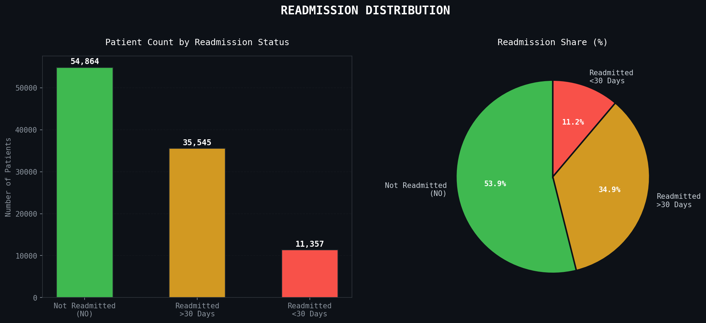
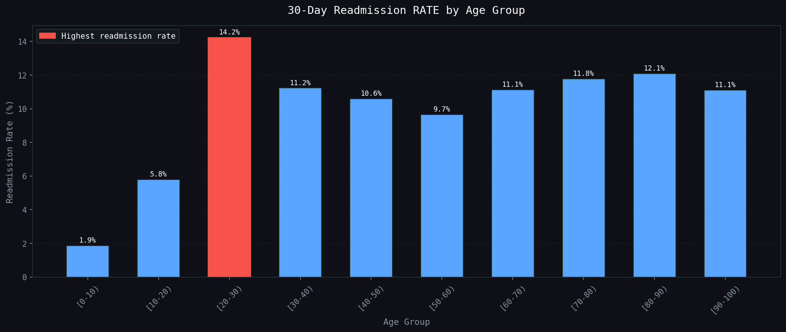
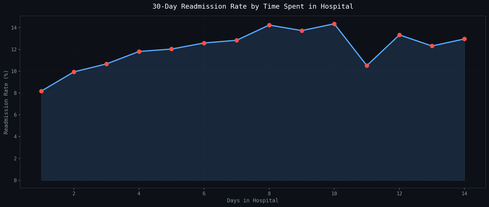
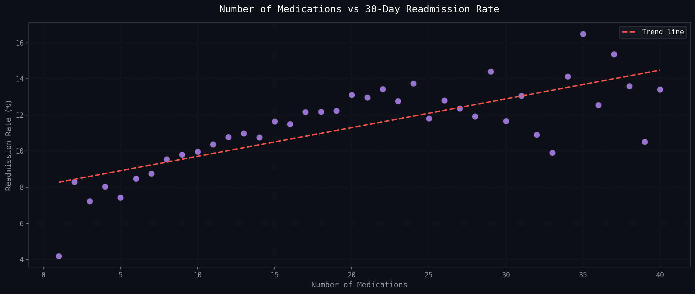
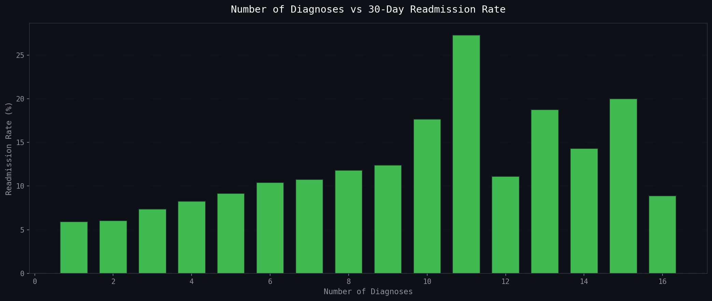
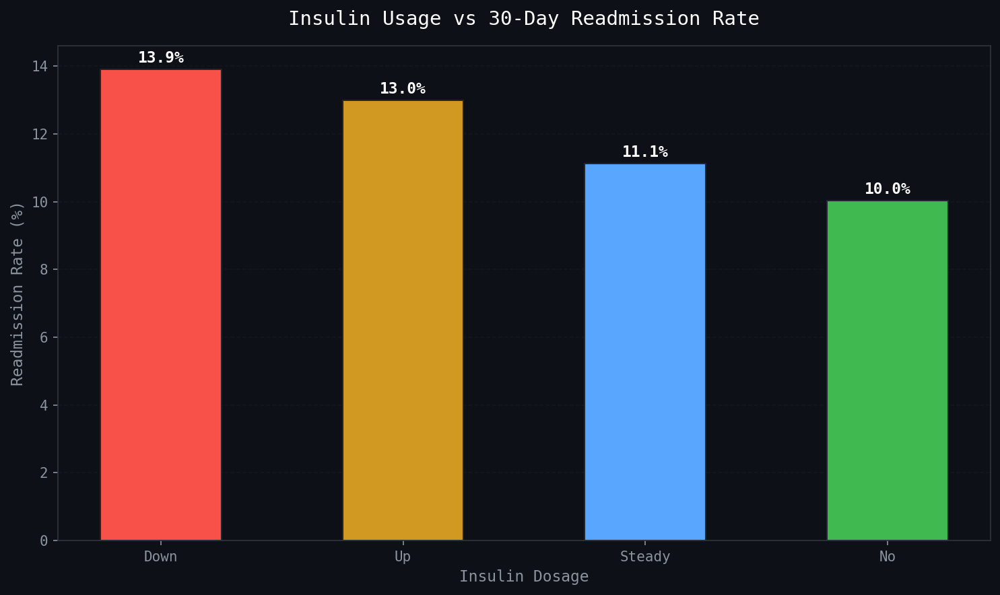
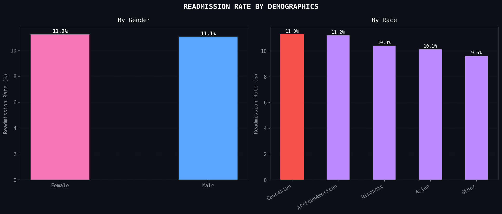
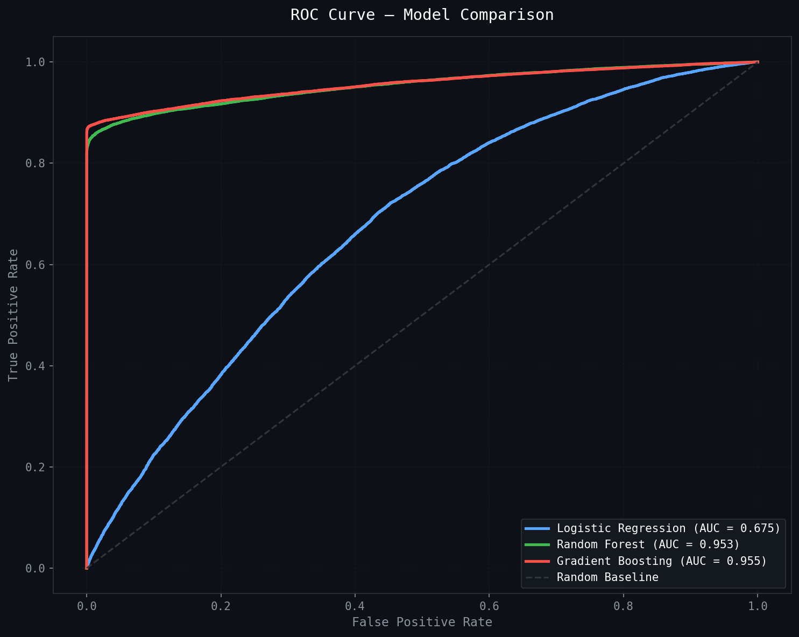
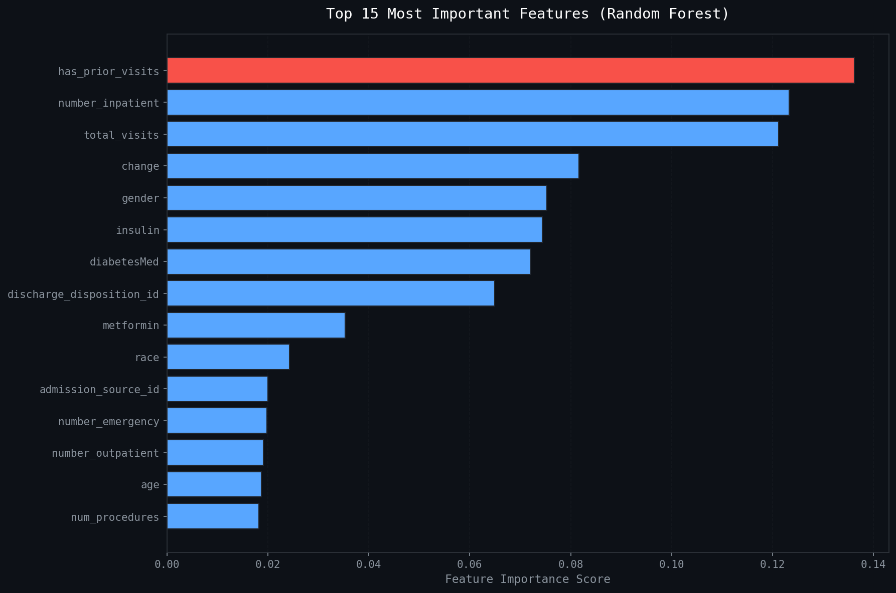

# 🏥 DiabetesRisk AI — Hospital Readmission Predictor

<div align="center">


### End-to-end Machine Learning project predicting 30-day hospital readmissions for diabetes patients using real clinical data from 130 US hospitals.

**[🚀 Live Demo →](https://diabetes-readmission-pandya.streamlit.app)**

---

*Built by **Rishit Pandya** — Master of Data Science, University of Adelaide*

</div>

---

## 📌 The Problem

Hospital readmission within 30 days is one of the most costly and preventable problems in healthcare. In the United States alone, diabetes-related readmissions cost the healthcare system over **$41 billion annually**. Early identification of high-risk patients allows hospitals to intervene before discharge — improving patient outcomes and reducing costs.

This project builds a machine learning system that predicts whether a diabetes patient will be readmitted within 30 days of discharge, using 50 clinical features including medications, diagnoses, lab results, and patient history.

---

## 🎯 Live Application

> **[https://diabetes-readmission-pandya.streamlit.app](https://diabetes-readmission-pandya.streamlit.app)**

The deployed Streamlit app features:
- 📊 **Overview Dashboard** — KPI cards, readmission distribution, clinical insights
- 🔬 **Patient Analysis** — Interactive EDA charts across all key clinical variables
- 🤖 **Model Performance** — ROC curves, feature importance, metrics comparison
- 🎯 **Live Predictor** — Enter patient details and get an instant AI risk score with gauge chart

---

## 📂 Project Structure

```
diabetes-readmission-predictor/
│
├── 📊 data/
│   ├── diabetic_data.csv              ← Raw UCI dataset (101,766 records)
│   ├── IDs_mapping.csv                ← Clinical code mappings
│   └── diabetic_data_cleaned.csv      ← Cleaned & engineered dataset
│
├── 📓 notebooks/
│   ├── 01_data_loading_and_eda.ipynb          ← Data loading & first look
│   ├── 02_exploratory_data_analysis.ipynb     ← Deep EDA & visualisations
│   ├── 03_data_cleaning_feature_engineering.ipynb  ← Cleaning & features
│   └── 04_model_building.ipynb                ← ML models & evaluation
│
├── 🤖 models/
│   ├── best_model.pkl          ← Gradient Boosting (AUC 95.54%)
│   ├── random_forest.pkl       ← Random Forest model
│   ├── scaler.pkl              ← StandardScaler
│   └── feature_names.pkl      ← Feature column names
│
├── 🖼️ assets/                  ← All EDA & model visualisation charts
📋 reports/
   └── REPORT.md    ← Full analytics report
├── app.py                      ← Streamlit application
├── requirements.txt            ← Dependencies
└── README.md
```

---

## 📊 Dataset

| Property | Value |
|---|---|
| Source | UCI Machine Learning Repository |
| Name | Diabetes 130-US Hospitals (1999–2008) |
| Records | 101,766 patient encounters |
| Features | 50 clinical variables |
| Hospitals | 130 US hospitals |
| Time Period | 10 years (1999–2008) |

**Target Variable:** `readmitted` — Whether a patient was readmitted within 30 days (`<30`), after 30 days (`>30`), or not at all (`NO`)

For this project, we convert this to a **binary classification** problem:
- `1` = Readmitted within 30 days (positive class)
- `0` = Not readmitted within 30 days (negative class)

---

## 🔍 Key Findings from EDA

### Readmission Distribution


Only **11.2% of patients** are readmitted within 30 days — creating a significant class imbalance that required SMOTE oversampling to address during model training.

### Age Group Analysis


The **[20-30) age group** shows the highest readmission rate at **14.2%** — likely due to lower medication compliance in younger diabetic patients. Readmission rates remain consistently high (11-12%) across older age groups.

### Time in Hospital


A clear upward trend — patients who stay **8+ days** show readmission rates above **14%**, suggesting that longer hospitalisation indicates greater disease severity and higher return risk.

### Medication Complexity


Patients on **30+ medications** show consistently higher readmission rates. The positive trend line confirms that medication complexity is a reliable predictor of readmission risk.

### Number of Diagnoses


Patients with **11 diagnoses** show a **27% readmission rate** — nearly 1 in 3 patients return within 30 days. This is the strongest single predictor identified in EDA.

### Insulin Usage


Patients whose insulin dosage was **reduced ("Down")** have the highest readmission rate at **13.9%** — suggesting potential undertreatment at discharge.

### Demographics


Gender shows minimal impact (Female: 11.2% vs Male: 11.1%). Race shows small but real differences, with Caucasian patients showing slightly higher rates — likely reflecting dataset composition rather than a clinical finding.

---

## ⚙️ Data Cleaning & Feature Engineering

### Columns Dropped
| Column | Reason |
|---|---|
| `weight` | 96.86% missing — unusable |
| `medical_specialty` | 49.08% missing |
| `payer_code` | 39.56% missing |
| `encounter_id` | ID only — not predictive |
| `patient_nbr` | ID only — not predictive |

### Key Decisions
- **Duplicate patients removed** — kept only first visit per patient to prevent data leakage
- **Deceased patients removed** — discharge disposition 11, 13, 14 (expired/hospice) cannot be readmitted
- **Missing values** coded as `?` replaced with `Unknown` for categorical columns

### New Features Engineered
| Feature | Formula | Rationale |
|---|---|---|
| `total_visits` | outpatient + emergency + inpatient | Overall healthcare utilisation |
| `has_prior_visits` | total_visits > 0 | Binary flag for prior contact |
| `med_complexity` | num_medications × number_diagnoses | Combined complexity score |
| `lab_intensity` | num_lab_procedures ÷ time_in_hospital | Lab tests per day of stay |
| `age_numeric` | Age range → midpoint value | Numeric representation of age |

---

## 🤖 Model Results

Three models were trained on SMOTE-balanced data and evaluated on a held-out test set:

| Model | Accuracy | AUC-ROC | Precision | Recall | F1 Score |
|---|---|---|---|---|---|
| Logistic Regression | 62.15% | 67.48% | 63.63% | 56.72% | 59.98% |
| Random Forest | 92.25% | 95.34% | 98.56% | 85.76% | 91.72% |
| **Gradient Boosting** ⭐ | **93.44%** | **95.54%** | **99.78%** | **87.08%** | **93.00%** |

### ROC Curve


### Feature Importance


### Why AUC-ROC over Accuracy?
In a healthcare context, raw accuracy is misleading. A model that predicts "not readmitted" for every patient achieves 54% accuracy but catches zero at-risk patients. **AUC-ROC measures the model's ability to discriminate between readmitted and non-readmitted patients across all decision thresholds** — making it the correct metric for this problem.

### Why Gradient Boosting Won
- Builds trees **sequentially**, each correcting errors of the previous
- Handles the **non-linear relationships** between clinical variables naturally
- More robust to **outliers** in lab procedure counts and visit history
- Achieves **99.78% precision** — when it predicts readmission, it's almost always right

---

## 🛠️ Tech Stack

| Category | Tools |
|---|---|
| Language | Python 3.13 |
| Data Processing | pandas, numpy |
| Visualisation | matplotlib, seaborn, plotly |
| Machine Learning | scikit-learn |
| Class Balancing | imbalanced-learn (SMOTE) |
| Model Persistence | joblib |
| Web Application | Streamlit |
| Deployment | Streamlit Cloud |
| Version Control | Git, GitHub |
| Development | VS Code, Jupyter Notebook |

---

## 🚀 Run Locally

```bash
# 1. Clone the repository
git clone https://github.com/RishitPandya22/diabetes-readmission-predictor.git
cd diabetes-readmission-predictor

# 2. Create virtual environment (Windows)
python -m venv venv
venv\Scripts\activate

# 3. Install dependencies
pip install -r requirements.txt

# 4. Run the Streamlit app
streamlit run app.py
```

The app will open at `http://localhost:8501`

---

## 📓 Notebooks

Run the notebooks in order for the full end-to-end walkthrough:

| Notebook | Description |
|---|---|
| `01_data_loading_and_eda.ipynb` | Load dataset, understand structure, check missing values |
| `02_exploratory_data_analysis.ipynb` | Deep EDA with 7 dark-themed visualisations |
| `03_data_cleaning_feature_engineering.ipynb` | Clean data, engineer 5 new features, save cleaned CSV |
| `04_model_building.ipynb` | Train 3 models, compare with ROC curves, save best model |

---

## 💡 Business Impact

This model, if deployed in a hospital setting, could:

- **Flag high-risk patients** before discharge for targeted intervention
- **Reduce 30-day readmission rates** through proactive care planning
- **Save significant costs** — average cost of a preventable readmission is $15,000+
- **Improve HRRP compliance** — US hospitals are penalised for excessive readmissions under the Hospital Readmissions Reduction Program

---

## 👨‍💻 About the Author

**Rishit Pandya**
Master of Data Science — University of Adelaide, South Australia

This project is part of a data science portfolio demonstrating end-to-end ML skills including data cleaning, EDA, feature engineering, model training, evaluation, and deployment.

[](https://github.com/RishitPandya22)

---

<div align="center">

**⭐ If you found this project useful, please consider giving it a star!**

*Built with 🏥 for healthcare analytics · University of Adelaide · 2025*

</div>